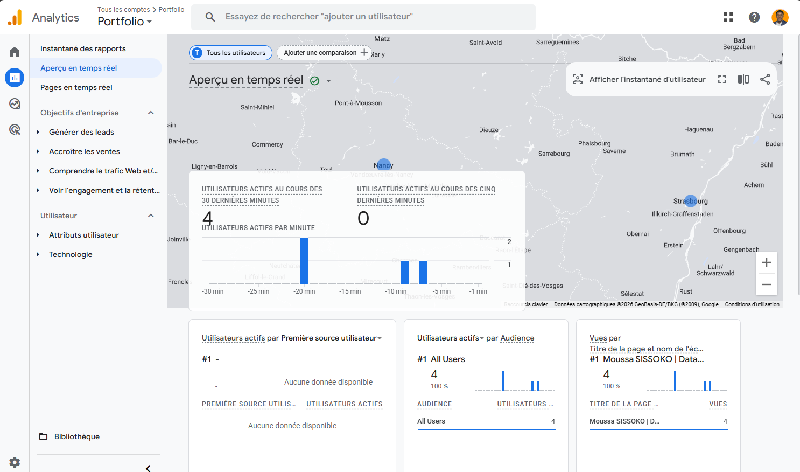

# 📊 Portfolio Data Analyst & Engineer

Bienvenue sur mon portfolio professionnel ! Je suis **Moussa Sissoko**, Data Analtics & Engineer spécialisé en finance quantitative, data engineering et machine learning.

Découvrez mes projets d'analyse de données, pipelines ETL, modèles prédictifs et visualisations interactives.

🌐 **[Visitez mon portfolio en ligne →](https://soradata.github.io/Analyst-Portfolio)**

---

## 🎯 Domaines d'expertise

- **Finance quantitative** : Optimisation de portefeuille, prédiction CAC40, analyse GARCH
- **Machine Learning** : XGBoost, LSTM, clustering, time series forecasting
- **Data Engineering** : Pipelines ETL, GCP, BigQuery, Airflow
- **Visualisation** : Streamlit, dashboards interactifs, Power BI

---

## 📈 Aperçu du Portfolio

---

## 🚀 Projets phares

> 📂 *Retrouvez tous mes projets détaillés sur le [portfolio web](https://soradata.github.io/Analyst-Portfolio)*

---

## 🛠️ Stack technique

**Langages** : Python • R • SQL • Bash  
**ML/Data** : Scikit-learn • XGBoost • TensorFlow • Pandas • NumPy  
**Cloud & Outils** : GCP • BigQuery • Airflow • Git • Docker  
**Visualisation** : Streamlit • Matplotlib • Seaborn • Plotly

---

## 📡 Traffic Analytics

Ce portfolio est instrumenté avec **Google Analytics GA4** afin de mesurer l'engagement des visiteurs en temps réel.

**Métriques suivies :**
- 👥 Utilisateurs uniques & sessions actives
- 🌍 Origine géographique des visiteurs
- 🔗 Sources de trafic (LinkedIn, GitHub, recherche organique)
- 📄 Pages et sections les plus consultées
- ⏱️ Durée moyenne de session & taux d'engagement

> *Cette démarche reflète un mindset data-driven appliqué à chaque projet — y compris ce portfolio lui-même.*

---

## 📬 Contact

Vous avez un projet data, une opportunité professionnelle ou simplement envie d'échanger ?

📧 **Email** : [sissokomoussa611@gmail.com](mailto:sissokomoussa611@gmail.com)  
💼 **LinkedIn** : [linkedin.com/in/moussa-sissoko-data-science](https://www.linkedin.com/in/moussa-sissoko-data-science/)  
🌐 **Portfolio** : [soradata.github.io/Analyst-Portfolio](https://soradata.github.io/Analyst-Portfolio)  
💻 **GitHub** : [@SORADATA](https://github.com/SORADATA)

---

⭐ *N'hésitez pas à star ce repo si vous trouvez mes projets intéressants !*
